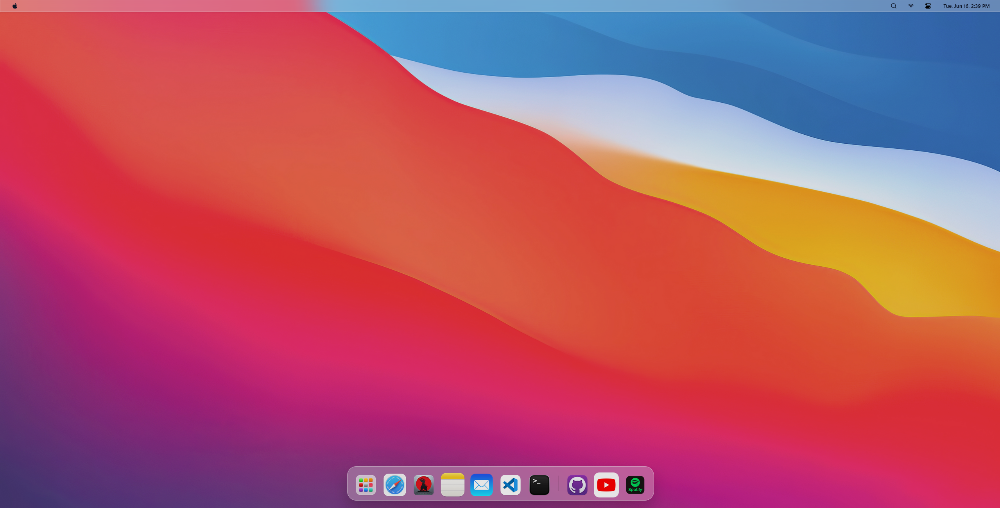

# 🍎 macOS Portfolio

A stunning, interactive macOS-inspired portfolio website built with Next.js and Tailwind CSS.



## 👨‍💻 Demo

Demo Link: https://mac-folio-os.vercel.app/

### ✨ Features

- 🖥️ Realistic macOS interface with dark/light mode
- 🚀 Interactive desktop experience with working windows
- 🔍 Spotlight search functionality
- 🧩 Multiple apps to showcase your skills and projects:
  - Safari
  - Notes (for bio/resume/about)
  - Terminal (interactive command line)
  - VSCode (code samples)
  - Mail (contact link)
  - GitHub (profile link)
  - Spotify (music player)
  - YouTube (YouTube channel link)
  - Resume
  - Snake
  - Weather (mock data)
- 🎛️ Working Control Center with brightness and volume controls
- 🔄 Boot, login, sleep, and shutdown sequences
- 📱 Almost fully responsive design
- ⚡ Fast and optimized performance

#### 🚀 Getting Started

##### Prerequisites

- Node.js 16.x or higher
- npm

##### Installation

```bash
git clone https://github.com/digitalturkk/MacFolioOS

cd macos-portfolio

npm install

npm run dev
```
Open [http://localhost:3000](http://localhost:3000) in your browser to see the result.

## 🎨 Customization

### Personal Information

Edit the following files to customize your portfolio:

- `components/apps/notes.tsx` - Your bio and personal information
- `components/apps/terminal.tsx` - Custom terminal commands and responses

### Social Links

Update your social media links in:

- `components/apps/github.tsx` - GitHub profile URL
- `components/apps/youtube.tsx` - YouTube channel URL
- `components/apps/mail.tsx` - Email address
- `components/apps/safari.tsx` - Featured websites and social links


### Appearance

- Replace wallpapers in `public/wallpaper-day.jpg` and `public/wallpaper-night.jpg`
- Update app icons in the `public` folder
- Modify the color scheme in `tailwind.config.ts`


## 📝 License

This project is licensed under the MIT License - see the [LICENSE](LICENSE) file for details.

**Important**: If you use this template for your own portfolio, you must include attribution to the original author. Please keep the attribution in the footer or about section of your site.

## 🙏 Acknowledgments

- Special thanks to [daprior](https://github.com/daprior/danielprior-macos) for the original inspiration for this macOS-themed portfolio concept.

## 📧 Contact

Daniel Prior - [huseynovfarid1111@gmail.com](mailto:huseynovfarid1111@gmail.com)

---

<p align="center"><sub>Made with passion and love.
If you like the project — give it a ⭐!</sub></p>
